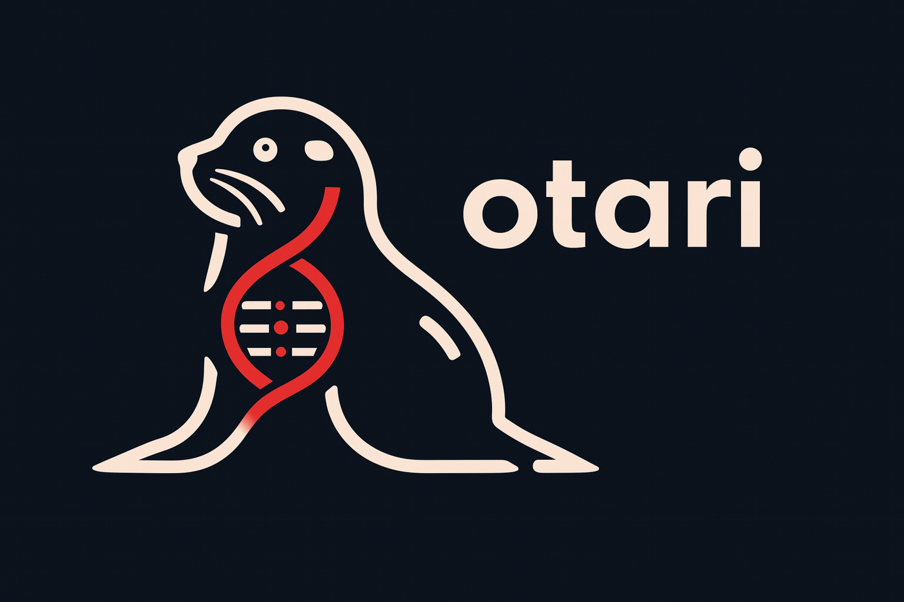

<p align="center">
  
</p>


Welcome to the Otari framework repository! Otari is a comprehensive and interpretable graph-based framework of transcript isoform regulation, powering the characterization of transcriptomic diversity and isoform-level variant effects at scale.

This repository can be used to run the Otari model and get the Otari regulatory profiles, isoform abundance predictions, and variant effect predictions for input sequences or variants.

We also provide information and instructions for [how to train the Otari graph neural network model](#training). 

### Requirements

Please create a new Anaconda environment specifically for running Otari: 

```
conda env create -n otari -f requirements.yml
conda activate otari
```

### Setup

Please download and extract the trained Otari model and `resources` (containing hg38 FASTA files) `.tar.gz` files before proceeding:

```
sh ./download_data.sh
```

- [Otari model](https://doi.org/10.5281/zenodo.4906996)
- [Otari framework `resources` directory](https://doi.org/10.5281/zenodo.4906961)


### Variant effect prediction

1. The following scripts can be used to obtain Otari variant effects at the isoform level (must run on a GPU node):
(1) `variant_effect_prediction.py` (and corresponding bash script, `variant_effect_prediction.sh`): Accepts a .tsv variant file as input and makes variant effect predictions.

Example usage:
```
sh variant_effect_prediction.sh <input-file> <output-dir>
```

Arguments:
- `<input-file>`: .tsv input file with variants. Format must be `chr \t pos \t ref \t alt`
- `<output-dir>`: Path to output directory (will be created if does not exist)

### Example variant effect prediction run

We provide `test.vcf` (hg38 coordinates) so you can try running this command once you have installed all the requirements. Additionally, `example_slurm_scripts` contains example scripts with the same expected input arguments if you need to submit your job to a compute cluster. 

Example command run on GPU:
```
sh variant_effect_prediction.sh test.vcf ./test_outputs
```

Expected outputs:
-  `variant_effects_comprehensive.tsv`: variant effect prediction for every isoform and tissue. Includes `max_effect` and `mean_effect` across tissues. 
- `max_variant_effects_across_transcripts.tsv`: variant effects aggregated by gene (max effect isoform for each gene and tissue).
- `interpretability_analysis.tsv`: interpretability metrics including most impacted node and features.
- `variant_to_most_affected_node_embedding.pkl`: node sequence attributes for the most impacted node for each variant and transcript.

## Training

The configuration file and script for running train is under the `train` directory. To run Otari model training, you will need GPU computing capability (we ran training on 1x Nvidia A100 GPU). 

The training data is available [here](https://doi.org/10.5281/zenodo.4907037) and should be downloaded and extracted into the `train` directory. 

```
cd ./train
sh ./download_data.sh  # in the train directory
```

The Otari training configuration YAML file is provided as the `train/configs.yml` file.

You can use the same conda environment to train Otari.

We also provide an example SLURM script `train/train.sh` for submitting a training job to a cluster.

## Help 
Please post in the Github issues or e-mail Aviya Litman (aviya@princeton.edu) with any questions. 

